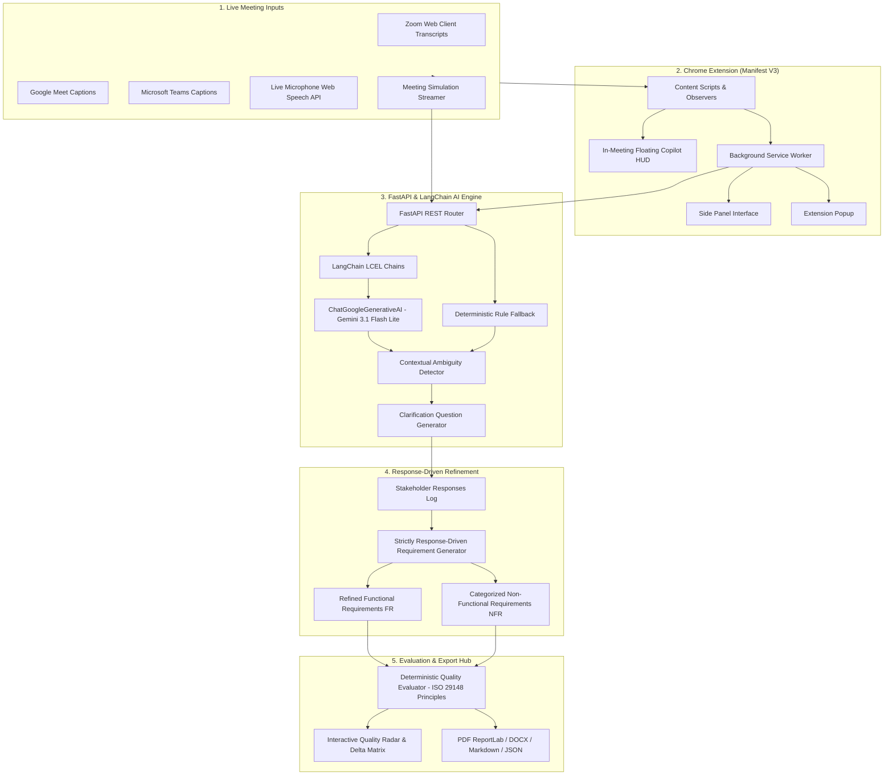

# AI-Powered Chrome Extension & Platform for Real-Time Requirement Analysis

[](https://www.python.org/)
[](https://fastapi.tiangolo.com/)
[](https://python.langchain.com/)
[](https://developer.chrome.com/docs/extensions/mv3/)
[](https://standards.ieee.org/)
[-brightgreen.svg)]()

> **Software Engineering Take-Home Assignment 2**: An AI-assisted Requirements Engineering platform and Manifest V3 Chrome Extension powered by **Python, FastAPI, and LangChain (`ChatGoogleGenerativeAI`)**. It monitors live Zoom/Meet meeting transcripts, detects ambiguous stakeholder statements in real time, generates targeted clarification questions, refines requirements based strictly on stakeholder answers, and performs requirement quality evaluation based on quality dimensions informed by ISO/IEC/IEEE 29148 principles.

> [!NOTE]
> **Demo Simulation Disclaimer**: In the assignment's supplied meeting dialogue, the transcript deliberately concludes with vague, unquantified statements (*"good enough"*, *"shouldn't be slow"*, *"ideally quick"*, *"solid projects"*, *"MVP soon"*). The clarification responses presented in the demonstration and test suites are **simulated stakeholder inputs** used to illustrate the end-to-end clarification and refinement workflow.

---

## 🏛️ System Architecture

The platform uses a **hybrid architecture** combining contextual LangChain pipelines with deterministic evaluation:
- **LangChain LCEL Pipelines (`ChatGoogleGenerativeAI`)**:
  - `build_baseline_chain`: Extracts raw baseline requirements without assuming clarification answers.
  - `build_clarify_chain`: Formulates targeted clarification questions with concrete SLO choices.
  - `build_refine_chain`: Performs strictly response-driven refinement incorporating confirmed stakeholder decisions.
  - `build_comparison_chain`: Conducts comprehensive before-vs-after qualitative audit.
- **FastAPI Async Backend**: High-performance REST API with Pydantic validation, OpenAPI documentation at `/docs`, and static file serving for the interactive Web Meeting Studio.
- **Deterministic Quality Evaluator**: Pure mathematical ratios (0–100%) across dimensions informed by ISO/IEC/IEEE 29148 principles (Ambiguity, Testability, Completeness, Specificity, Traceability).
- **Manifest V3 Chrome Extension**: Real-time caption observer for Zoom Web and Google Meet with in-meeting floating copilot HUD, Popup, and Side Panel.



---

## 📊 Comparative Evaluation: Without vs. With Clarification

Based on the assignment conversation (AI-based Resume Analyzer meeting between Hiring Manager and ML Engineer):

### 1. Requirements Transformation Matrix

| Requirement Area | Without Clarification (Baseline / Raw) | With Clarification (Simulated Stakeholder Input) | Impact & Provenance |
| :--- | :--- | :--- | :--- |
| **Performance NFR** | *"The system shouldn't be slow and response time per resume should ideally be quick."* | **NFR-PERF-01**: The system shall process single resumes within 1.50s (p95) and batch uploads of 100 resumes within 30.0s. | Replaced subjective *"quick"* with stakeholder-specified latency SLOs ($p95 < 1.5\text{s}$). |
| **Fairness & Bias NFR** | *"Yes, we must avoid bias, especially related to gender or college background."* | **NFR-FAIR-01**: The system shall enforce a Disparate Impact Ratio between 0.80 and 1.25 across gender and college tiers with automated PII redaction. | Replaced vague *"avoid bias"* with stakeholder-approved Disparate Impact threshold ($0.80 \le \text{DIR} \le 1.25$). |
| **Accuracy NFR** | *"It should be good enough so that HR trusts it."* | **NFR-ACC-01**: The candidate shortlisting model shall achieve Top-10 Precision $\ge 85.0\%$ and $\text{NDCG@10} \ge 0.82$ against senior human recruiter test set. | Converted subjective *"trust"* into verifiable Ranking Precision and NDCG benchmark. |
| **Explainability FR** | *"Do we need explainability? ... Yes, that would be useful."* | **FR-03**: The system shall display an interactive candidate match scorecard showing matched skills %, project impact score, and top 3 justification reasons. | Specified concrete presentation schema and response latency based on recruiter preference. |
| **Scoring Formula FR** | *"Things like good companies, solid projects, impactful work... strong fresher."* | **FR-02**: The system shall calculate candidate relevance using a weighted multi-factor formula: $45\%$ skills match, $35\%$ project impact, $20\%$ experience with fresher normalization. | Eliminated undefined *"solid projects"* with deterministic scoring formula. |
| **Data Ingestion FR** | *"We have past resumes... but they're not very structured."* | **FR-01**: The system shall ingest resumes in PDF and DOCX formats (up to 10MB per file) and parse text into structured JSON schemas. | Defined supported file formats and size constraints based on stakeholder specification. |
| **Project Scope NFR** | *"We need an MVP soon."* | **NFR-SCOPE-01**: The MVP deliverable shall be delivered within a 4-week milestone covering ingestion, JD matching, top-10 ranking, and scorecard export. | Established concrete deadline and scope checklist based on stakeholder timeline. |

### 2. Pure Mathematical Quality Scorecard (Dimensions Informed by ISO/IEC/IEEE 29148 Principles)

| Quality Dimension | Metric Formula | Without Clarification | With Clarification | Improvement ($\Delta$) |
| :--- | :--- | :---: | :---: | :---: |
| **Overall Quality Index (OQI)** | Weighted composite score ($0 - 100$) | **8% (Poor)** | **100% (Excellent)** | **+92 pts (+1150%)** |
| **Ambiguity Level** | $(\text{Flagged Unresolved Reqs} / \text{Total}) \times 100$ | 100% | 0% | **-100% reduction** |
| **Testability & Verifiability** | $(\text{Requirements with Measurable Criteria} / \text{Total}) \times 100$ | 0% | 100% | **+100% gain** |
| **Completeness Coverage** | $(\text{Resolved Relevant NFRs} / \text{Total Identified Dimensions}) \times 100$ | 0% | 100% | **+100% gain** |
| **Specificity & SLOs** | $(\text{Requirements with Explicit Non-Empty Thresholds} / \text{Total}) \times 100$ | 0% | 90% | **+90% gain** |
| **Traceability** | $(\text{Requirements Linked to Stakeholder Answers} / \text{Total}) \times 100$ | 50% | 100% | **+50% gain** |

---

## 🚀 Quick Start Guide

### 1. Installation
```bash
git clone https://github.com/Neel7780/AI-Powered-Chrome-Extension-for-Real-Time-Requirement-Analysis.git
cd AI-Powered-Chrome-Extension-for-Real-Time-Requirement-Analysis

# Setup Python Virtual Environment
python3 -m venv venv
source venv/bin/activate
pip install -r requirements.txt
```

### 2. Configure Environment
Create `.env`:
```env
GEMINI_API_KEY=your_gemini_api_key_here
PORT=3000
```

### 3. Run Automated Tests
```bash
# Run complete pytest suite
venv/bin/pytest backend/tests/ -v
```

### 4. Start FastAPI Server & Web Studio
```bash
python3 run.py
```
- Web Application Studio: **[http://localhost:3000](http://localhost:3000)**
- Interactive API Documentation: **[http://localhost:3000/docs](http://localhost:3000/docs)**

---

## 🧩 Installing the Chrome Extension

1. Open Google Chrome and go to `chrome://extensions/`.
2. Enable **Developer mode** (top-right toggle).
3. Click **Load unpacked** and select the `extension/` directory.
4. Join any Zoom Web, Google Meet, or Teams meeting to view the live **Requirement Copilot HUD** and **Side Panel**.

---

## 🧪 Verified Pytest Suite (23 / 23 Tests Passing)

```text
backend/tests/test_api_endpoints.py::test_health_endpoint PASSED         [  4%]
backend/tests/test_api_endpoints.py::test_analyze_endpoint PASSED        [  8%]
backend/tests/test_api_endpoints.py::test_clarify_endpoint PASSED        [ 13%]
backend/tests/test_api_endpoints.py::test_refine_endpoint PASSED         [ 17%]
backend/tests/test_api_endpoints.py::test_compare_endpoint PASSED        [ 21%]
backend/tests/test_api_endpoints.py::test_export_txt_endpoint PASSED     [ 26%]
backend/tests/test_api_endpoints.py::test_export_json_endpoint PASSED    [ 30%]
backend/tests/test_langchain_chains.py::test_chain_builders_structure PASSED [ 34%]
backend/tests/test_langchain_chains.py::test_llm_service_configuration PASSED [ 39%]
backend/tests/test_master_hardening.py::test_a_zero_answers_pending_and_zero_testability PASSED [ 43%]
backend/tests/test_master_hardening.py::test_b_partial_answers_proportional_score PASSED [ 47%]
backend/tests/test_master_hardening.py::test_c_full_answers_high_quality PASSED [ 52%]
backend/tests/test_master_hardening.py::test_d_offline_mode_resilience PASSED [ 56%]
backend/tests/test_master_hardening.py::test_e_explicit_stakeholder_adoption PASSED [ 60%]
backend/tests/test_master_hardening.py::test_f_non_occurrence_of_unselected_values PASSED [ 65%]
backend/tests/test_master_hardening.py::test_g_duplicate_suppression PASSED [ 69%]
backend/tests/test_master_hardening.py::test_h_conflict_detection PASSED [ 73%]
backend/tests/test_master_hardening.py::test_i_traceability_lineage PASSED [ 78%]
backend/tests/test_regression.py::test_r1_questions_generate_validation PASSED [ 82%]
backend/tests/test_regression.py::test_r2_every_answered_clarification_resolves_all_ten PASSED [ 86%]
backend/tests/test_regression.py::test_r3_no_cross_slot_leakage PASSED   [ 91%]
backend/tests/test_regression.py::test_r4_word_boundary_safe_domain PASSED [ 95%]
backend/tests/test_regression.py::test_r5_generic_refiner_requires_real_answer PASSED [100%]
```

---

## ⚖️ Academic Attribution & License
MIT License. Built for Software Engineering Take-Home Assignment 2 (Student ID: `202401093`).
Quality evaluation dimensions are informed by principles of ISO/IEC/IEEE 29148 standard for requirements engineering.
