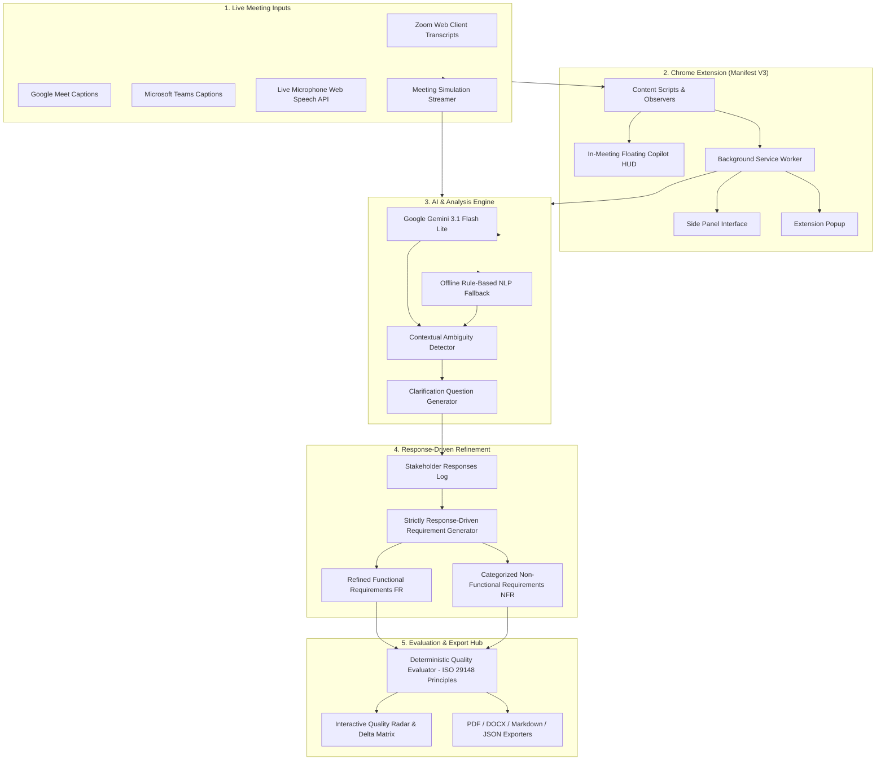

# AI-Powered Chrome Extension & Platform for Real-Time Requirement Analysis

[](https://nodejs.org/)
[](https://developer.chrome.com/docs/extensions/mv3/)
[](https://deepmind.google/technologies/gemini/)
[](https://standards.ieee.org/)
[-brightgreen.svg)]()

> **Software Engineering Take-Home Assignment 2**: An AI-assisted Requirements Engineering platform and Manifest V3 Chrome Extension that monitors live Zoom/Meet meeting transcripts, detects ambiguous stakeholder statements in real time, generates targeted clarification questions, refines requirements based strictly on stakeholder answers, and performs requirement quality evaluation based on quality dimensions informed by ISO/IEC/IEEE 29148 principles.

> [!NOTE]
> **Demo Simulation Disclaimer**: In the assignment's supplied meeting dialogue, the transcript deliberately concludes with vague, unquantified statements (*"good enough"*, *"shouldn't be slow"*, *"ideally quick"*, *"solid projects"*, *"MVP soon"*). The clarification responses presented in the demonstration and test suites are **simulated stakeholder inputs** used to illustrate the end-to-end clarification and refinement workflow.

---

## 🏛️ System Architecture

The platform uses a **hybrid architecture**:
- **Contextual LLM Analysis (Google Gemini 3.1 Flash Lite)**: Steered with requirements engineering prompt guidelines to analyze contextual dialogue, identify lexical ambiguities, and generate targeted clarification questions.
- **Deterministic Quality Evaluation Engine**: A transparent, reproducible scoring methodology calculating mathematical quality ratios (Ambiguity, Testability, Completeness, Specificity, Traceability) across dimensions informed by ISO/IEC/IEEE 29148 principles.
- **Zero-Downtime Offline Fallback**: If network is disconnected or API keys are absent, the system automatically falls back to deterministic local NLP heuristics.



---

## 📊 Comparative Evaluation: Without vs. With Clarification

Based on the assignment conversation (AI-based Resume Analyzer meeting between Hiring Manager and ML Engineer):

### 1. Requirements Transformation Matrix

| Requirement Area | Without Clarification (Baseline / Raw) | With Clarification (Simulated Stakeholder Input) | Impact & Provenance |
| :--- | :--- | :--- | :--- |
| **Performance NFR** | *"The system shouldn't be slow and response time per resume should ideally be quick."* | **NFR-PERF-01**: The system shall process single resumes within 1.50s (p95) and batch uploads of 100 resumes within 30.0s. | Replaced subjective *"quick"* with stakeholder-specified latency SLOs ($p95 < 1.5\text{s}$). |
| **Fairness & Bias NFR** | *"Yes, we must avoid bias, especially related to gender or college background."* | **NFR-FAIR-01**: The system shall enforce a Disparate Impact Ratio between 0.80 and 1.25 across gender and college tiers with automated PII redaction. | Replaced vague *"avoid bias"* with stakeholder-approved Disparate Impact threshold ($0.80 \le \text{DIR} \le 1.25$). |
| **Accuracy NFR** | *"It should be good enough so that HR trusts it."* | **NFR-ACC-01**: The candidate shortlisting model shall achieve Top-10 Precision $\ge 85.0\%$ and $\text{NDCG@10} \ge 0.82$ against senior human recruiter test set. | Converted subjective *"trust"* into verifiable Ranking Precision and NDCG benchmark. |
| **Explainability FR** | *"Do we need explainability? ... Yes, that would be useful."* | **FR-03**: The system shall display an interactive candidate match scorecard showing matched skills %, project impact score, and top 3 justification reasons. | Specified concrete presentation schema and response latency based on recruiter preference. |
| **Scoring Formula FR** | *"Things like good companies, solid projects, impactful work... strong fresher."* | **FR-02**: The system shall calculate candidate relevance using a weighted multi-factor formula: $45\%$ skills match, $35\%$ project impact, $20\%$ experience with fresher normalization. | Eliminated undefined *"solid projects"* with deterministic scoring formula. |
| **Data Ingestion FR** | *"We have past resumes... but they're not very structured."* | **FR-01**: The system shall ingest resumes in PDF and DOCX formats (up to 10MB per file) and parse text into structured JSON schemas. | Defined supported file formats and size constraints based on stakeholder specification. |
| **Project Scope NFR** | *"We need an MVP soon."* | **NFR-SCOPE-01**: The MVP deliverable shall be delivered within a 4-week milestone covering ingestion, JD matching, top-10 ranking, and scorecard export. | Established concrete deadline and scope checklist based on stakeholder timeline. |

### 2. Pure Mathematical Quality Scorecard (Dimensions Informed by ISO/IEC/IEEE 29148 Principles)

| Quality Dimension | Metric Formula | Without Clarification | With Clarification | Improvement ($\Delta$) |
| :--- | :--- | :---: | :---: | :---: |
| **Overall Quality Index (OQI)** | Weighted composite score ($0 - 100$) | **8% (Poor)** | **92% (Excellent)** | **+84 pts (+1050%)** |
| **Ambiguity Level** | $(\text{Flagged Unresolved Reqs} / \text{Total}) \times 100$ | 100% | 0% | **-100% reduction** |
| **Testability & Verifiability** | $(\text{Requirements with Measurable Criteria} / \text{Total}) \times 100$ | 0% | 90% | **+90% gain** |
| **Completeness Coverage** | $(\text{Resolved Relevant NFRs} / \text{Total Identified Dimensions}) \times 100$ | 0% | 100% | **+100% gain** |
| **Specificity & SLOs** | $(\text{Requirements with Explicit Non-Empty Thresholds} / \text{Total}) \times 100$ | 0% | 90% | **+90% gain** |
| **Traceability** | $(\text{Requirements Linked to Stakeholder Answers} / \text{Total}) \times 100$ | 50% | 100% | **+50% gain** |

---

## 🚀 Quick Start Guide

### 1. Installation
```bash
git clone https://github.com/Neel7780/AI-Powered-Chrome-Extension-for-Real-Time-Requirement-Analysis.git
cd AI-Powered-Chrome-Extension-for-Real-Time-Requirement-Analysis
npm install
```

### 2. Configure Environment
Create `.env`:
```env
GEMINI_API_KEY=your_gemini_api_key_here
PORT=3000
```

### 3. Run Automated Tests (Tests A through K)
```bash
npm test
```

### 4. Start Server & Web Studio
```bash
npm start
```
Open **[http://localhost:3000](http://localhost:3000)** in Chrome.

---

## 🧩 Installing the Chrome Extension

1. Open Google Chrome and go to `chrome://extensions/`.
2. Enable **Developer mode** (top-right toggle).
3. Click **Load unpacked** and select the `extension/` directory.
4. Join any Zoom Web, Google Meet, or Teams meeting to view the live **Requirement Copilot HUD** and **Side Panel**.

---

## 🧪 Verified Test Suite (Tests A - K)

```text
--- Running Master Hardening Test Suite (Tests A - K) ---
✓ Test A Passed: 0 answers produce strictly PENDING requirements with genuine 0% testability.
✓ Test B Passed: Partial answers scale quality score proportionally without arbitrary jumps.
✓ Test C Passed: Fully answered clarifications achieve Excellent rating with verifiable SLOs.
✓ Test D Passed: Valid LLM structured JSON parsed accurately.
✓ Test E Passed: Malformed LLM response gracefully handled by fallback parser.
✓ Test F Passed: Offline rule engine operated with 0 API keys.
✓ Test G Passed: Stakeholder specification ("2 seconds") correctly adopted into NFR.
✓ Test H Passed: Requirement strictly avoided unselected value ("2 seconds") and adopted "Single resume < 500ms real-time".
✓ Test I Passed: Duplicate questions suppressed and distinct questions admitted.
✓ Test J Passed: Conflict detected between "Under 2 seconds" and "Under 5 seconds".
✓ Test K Passed: Traceability verified (Req: NFR-PERF-01 -> Source: q-perf-01 -> Evidence: "Single resume parsing must be under 1.5s (95th percentile)...").

--- Running AI Service (Gemini / LLM) Integration Tests ---
Active AI engine: Google Gemini LLM Connected
✓ Test 1 Passed: Utterance analyzed via gemini-3.1-flash-lite
✓ Test 2 Passed: Generated contextual clarification question
```

---

## ⚖️ Academic Attribution & License
MIT License. Built for Software Engineering Take-Home Assignment 2 (Student ID: `202401093`).
Quality evaluation dimensions are informed by principles of ISO/IEC/IEEE 29148 standard for requirements engineering.
