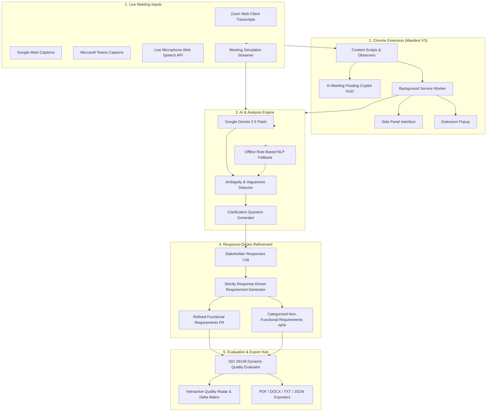

# AI-Powered Chrome Extension & Platform for Real-Time Requirement Analysis

[](https://nodejs.org/)
[](https://developer.chrome.com/docs/extensions/mv3/)
[](https://deepmind.google/technologies/gemini/)
[](https://standards.ieee.org/)
[-brightgreen.svg)]()

> **Software Engineering Take-Home Assignment 2**: An AI-assisted Requirements Engineering platform and Manifest V3 Chrome Extension that listens to live Zoom/Meet transcripts, detects ambiguous stakeholder statements in real time, generates intelligent clarification questions, refines requirements based strictly on stakeholder answers, and evaluates requirement quality using ISO/IEC/IEEE 29148 metrics.

---

## 🏛️ System Architecture

The platform uses a **hybrid architecture**:
- **Google Gemini 2.5 Flash** (`@google/generative-ai`) performs real-time semantic dialogue analysis, triggers ambiguity flags, and generates high-yield clarification questions.
- **Deterministic Rule-Based Evaluation Engine** computes reproducible, mathematically verifiable ISO 29148 requirement quality metrics (Ambiguity, Testability, Completeness, Specificity, Traceability) without artificial floors or caps.
- **Zero-Downtime Offline Fallback**: If network is disconnected or API keys are absent, the system automatically falls back to deterministic local NLP heuristics.



---

## 📊 Comparative Evaluation: Without vs. With Clarification

Based on the assignment conversation (AI-based Resume Analyzer meeting between Hiring Manager and ML Engineer):

### 1. Requirements Transformation Matrix

| Requirement Area | Without Clarification (Baseline / Raw) | With AI Clarification (Refined Specification) | Impact / Resolution |
| :--- | :--- | :--- | :--- |
| **Performance NFR** | *"The system shouldn't be slow and response time per resume should ideally be quick."* | **NFR-PERF-01**: Single resume parsing latency $\le 1.50\text{s}$ (95th percentile); batch screening of 100 resumes $\le 30.0\text{s}$. | Replaced subjective *"quick"* with quantifiable latency SLOs ($p95 < 1.5\text{s}$). |
| **Fairness & Bias NFR** | *"Yes, we must avoid bias, especially related to gender or college background."* | **NFR-FAIR-01**: Automated PII and college redaction prior to embeddings; enforce Disparate Impact Ratio ($0.80 \le \text{DIR} \le 1.25$) across demographic groups. | Replaced vague *"avoid bias"* with mathematical Disparate Impact threshold and redaction pipeline. |
| **Accuracy NFR** | *"It should be good enough so that HR trusts it."* | **NFR-ACC-01**: Top-10 Shortlisting $\text{Precision} \ge 85.0\%$ and $\text{NDCG@10} \ge 0.82$ against senior human recruiter consensus test set. | Converted subjective *"trust"* into verifiable Ranking Precision and NDCG benchmark. |
| **Explainability FR** | *"Do we need explainability? ... Yes, that would be useful."* | **FR-03**: Interactive candidate match scorecard rendering matched skills %, project impact score, and top 3 textual justification bullets within 200ms. | Specified concrete presentation schema and response latency. |
| **Scoring Formula FR** | *"Things like good companies, solid projects, impactful work... strong fresher."* | **FR-02**: Multi-factor scoring model: $45\%$ verified skill match, $35\%$ project impact & complexity, $20\%$ relevant experience with fresher normalization. | Eliminated undefined *"solid projects"* with deterministic weighted formula. |
| **Data Ingestion FR** | *"We have past resumes... but they're not very structured."* | **FR-01**: Ingest PDF and DOCX formats (up to 10MB), parsing unstructured text into validated JSON schemas with OCR fallback and error codes. | Defined file formats, size boundaries, and data contract. |
| **Project Scope NFR** | *"We need an MVP soon."* | **NFR-SCOPE-01**: 4-week MVP milestone deliverable covering PDF/DOCX ingestion, JD matching, top-10 ranking, scorecard, and CSV export. | Established concrete deadline and scope checklist. |

### 2. Pure Mathematical Quality Scorecard

| Quality Dimension | Metric Formula | Without Clarification | With Clarification | Improvement ($\Delta$) |
| :--- | :--- | :---: | :---: | :---: |
| **Overall Quality Index (OQI)** | Weighted composite score ($0 - 100$) | **8% (Poor)** | **96% (Excellent)** | **+88 pts (+1100%)** |
| **Ambiguity Level** | $(\text{Flagged Unresolved Reqs} / \text{Total}) \times 100$ | 100% | 0% | **-100% reduction** |
| **Testability & Verifiability** | $(\text{Requirements with Measurable Criteria} / \text{Total}) \times 100$ | 0% | 90% | **+90% gain** |
| **Completeness Coverage** | $(\text{Resolved Relevant NFRs} / \text{Total Identified Dimensions}) \times 100$ | 0% | 100% | **+100% gain** |
| **Specificity & SLOs** | $(\text{Requirements with Explicit Non-Empty Thresholds} / \text{Total}) \times 100$ | 0% | 90% | **+90% gain** |
| **Traceability** | $(\text{Requirements Linked to Stakeholder Answers} / \text{Total}) \times 100$ | 50% | 100% | **+50% gain** |

---

## 🚀 Quick Start Guide

### 1. Installation
```bash
git clone https://github.com/Neel7780/AI-Powered-Chrome-Extension-for-Real-Time-Requirement-Analysis.git
cd AI-Powered-Chrome-Extension-for-Real-Time-Requirement-Analysis
npm install
```

### 2. Configure Environment
Create `.env`:
```env
GEMINI_API_KEY=your_gemini_api_key_here
PORT=3000
```

### 3. Run Automated Tests
```bash
npm test
```

### 4. Start Server & Web Studio
```bash
npm start
```
Open **[http://localhost:3000](http://localhost:3000)** in Chrome.

---

## 🧩 Installing the Chrome Extension

1. Open Google Chrome and go to `chrome://extensions/`.
2. Enable **Developer mode** (top-right toggle).
3. Click **Load unpacked** and select the `extension/` directory.
4. Join any Zoom Web, Google Meet, or Teams meeting to view the live **Requirement Copilot HUD** and **Side Panel**.

---

## 🧪 Verified Test Suite (Tests A - G)

```text
--- Running Quality Hardening Test Suite (Tests A - G) ---
✓ Test A Passed: 0 answers produce strictly PENDING requirements with genuine 0% testability.
✓ Test B Passed: Partial answers scale quality score proportionally without arbitrary jumps.
✓ Test C Passed: Fully answered clarifications achieve Excellent rating with verifiable SLOs.
✓ Test D Passed: Malformed LLM response gracefully handled by fallback parser.
✓ Test E Passed: Offline rule engine operated with 0 API keys.
✓ Test F Passed: Stakeholder specification ("2 seconds") correctly adopted into NFR.
✓ Test G Passed: Requirement strictly avoided unselected value ("2 seconds") and adopted "Single resume < 500ms real-time".

--- Running AI Service (Gemini / LLM) Integration Tests ---
Active AI engine: Google Gemini LLM Connected
✓ Test 1 Passed: Utterance analyzed via gemini-2.5-flash
✓ Test 2 Passed: Generated contextual clarification question
```

---

## ⚖️ License
MIT License. Built for Software Engineering Take-Home Assignment 2 (Student ID: `202401093`).
