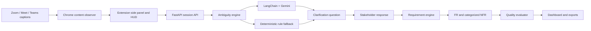

# Architecture: AI-Powered Real-Time Requirement Analysis

## 1. One-Minute Explanation

This project is a Manifest V3 Chrome Extension and a Python FastAPI application for live requirements engineering.

During a meeting, the extension reads transcript or caption text from Zoom, Google Meet, or Teams. Each utterance is analyzed for vague, incomplete, subjective, or non-measurable language. When ambiguity is detected, the system creates a targeted clarification question with measurable options.

The stakeholder can answer the question. After the meeting is complete, the system generates:

- Baseline Functional Requirements and Non-Functional Requirements without clarification
- Refined Functional Requirements and Non-Functional Requirements with clarification
- NFR categories such as Performance, Fairness, Security, Reliability, and Usability
- Quality metrics comparing both versions
- PDF, DOCX, TXT, and JSON reports

The most important design rule is that the system does not treat suggested values as stakeholder decisions. A requirement becomes resolved only when a stakeholder answer is recorded.

## 2. Architecture



### Main components

| Component | Location | Responsibility |
|---|---|---|
| FastAPI application | `backend/app/main.py` | Application setup, CORS, routes, static webapp |
| Session API | `backend/app/routes/session.py` | Live transcript, clarification, reset, finalize, WebSocket |
| Session state | `backend/app/services/session_manager.py` | Shared state for dashboard and extension |
| Ambiguity engine | `backend/app/services/ambiguity_engine.py` | Rules, flags, scores, clarification questions |
| LangChain service | `backend/app/services/llm_service.py` | Gemini model creation and model fallback |
| Requirement engine | `backend/app/services/requirement_engine.py` | Baseline/refined FR and NFR generation |
| Quality evaluator | `backend/app/services/quality_evaluator.py` | Deterministic quality metrics |
| Chrome extension | `extension/` | Caption capture, popup, HUD, side panel |
| Web dashboard | `webapp/` | Meeting simulation and visual analysis studio |

## 3. How To Run It

```bash
source venv/bin/activate.fish
python3 run.py
```

Open:

```text
http://localhost:3000
```

FastAPI documentation:

```text
http://localhost:3000/docs
```

Run tests:

```bash
venv/bin/pytest backend/tests/ -q
```

Expected result is currently:

```text
24 passed, 1 skipped
```

Load the extension:

1. Open `chrome://extensions`.
2. Enable Developer mode.
3. Click Load unpacked.
4. Select the `extension/` folder, not the project root.
5. Reload the extension after code changes.

## 4. End-to-End Data Flow

### Step 1: Capture an utterance

A content script observes caption/transcript DOM changes. The extension sends each new statement to the FastAPI session endpoint:

```javascript
await fetch(`${SERVER_URL}/api/session/utterance`, {
  method: 'POST',
  headers: { 'Content-Type': 'application/json' },
  body: JSON.stringify({
    text: u.text,
    speaker: u.speaker,
    timestamp: u.timestamp
  })
});
```

### Step 2: Analyze ambiguity

The session manager calls the ambiguity engine:

```python
analysis = ambiguity_engine.analyze_utterance(text)
flags_data = [flag.model_dump() for flag in analysis.detectedFlags]
```

The engine first applies grounded deterministic rules. Examples include:

- `good enough` or `trust` -> Accuracy
- `fast`, `quick`, or `slow` -> Performance
- `avoid bias` or `gender` -> Fairness
- `easy to use` -> Usability
- `reliable` -> Reliability
- `secure` or payment protection -> Security

The rules produce a phrase, category, severity, reason, and suggested SLO.

### Step 3: Use LangChain and Gemini

For a statement already flagged by a grounded rule, LangChain may perform contextual enrichment:

```python
if rule_flags and llm_service.is_available():
    result, model_used = llm_service.invoke_with_fallback(
        build_clarify_chain,
        {'transcript': text}
    )
```

The rule flags remain authoritative. A free-form LLM response is not allowed to mark every utterance ambiguous merely because it contains words such as `ambiguous`.

The configured model is:

```env
GEMINI_MODEL=gemini-3.1-flash-lite
```

### Step 4: Generate a clarification question

For an ambiguous statement, the engine creates a question and measurable options:

```python
q = ambiguity_engine.generate_fallback_question(
    text,
    analysis.detectedFlags
)
self.clarifications.append(q.model_dump())
```

Example:

```text
Statement: It should be very fast.
Question: What specific latency threshold defines acceptable performance?
Options:
- Single resume < 1.50s (p95) and batch of 100 < 30.0s
- Single resume < 500ms real-time latency
- Define the performance target with stakeholders
```

The options are suggestions, not answers. The stakeholder must select or type the actual decision.

### Step 5: Finalize the meeting

While the meeting is live, the system publishes transcript and clarification data only. It does not publish final FR/NFR or quality output.

```python
if not self.is_finalized:
    self.baseline = {'frs': [], 'nfrs': []}
    self.refined = {'frs': [], 'nfrs': []}
    self.evaluation = {}
    return
```

At the end, the dashboard or extension calls:

```text
POST /api/session/finalize
```

Then the requirement engine and quality evaluator run.

## 5. Baseline Versus Refined Requirements

The baseline is created with an empty clarification list. It preserves vague wording:

```text
The system shall rank candidates based on relevance, skills,
and overall profile strength (exact scoring weights pending clarification).
```

The refined version uses only confirmed stakeholder answers:

```text
The system shall calculate candidate relevance using the confirmed
45% skills, 35% project impact, and 20% experience weighting.
```

If there is no answer, the refined item remains explicit:

```text
Status: PENDING_CLARIFICATION
Target: Unspecified - Awaiting Stakeholder Clarification
```

This prevents fabricated requirements and makes traceability possible.

## 6. Quality Evaluation

The evaluator calculates five deterministic dimensions:

1. Ambiguity: percentage of pending or flagged requirements. Lower is better.
2. Testability: percentage with measurable criteria, acceptance criteria, or verification methods.
3. Specificity: percentage with explicit measurable values or thresholds.
4. Completeness: resolved requirement ratio plus resolved NFR category coverage.
5. Traceability: requirements connected to stakeholder clarification or source statements.

The overall quality index is a weighted score:

$$
OQI = 0.25C + 0.25T + 0.20S + 0.15R + 0.15(100-A)
$$

where:

- $C$ is completeness
- $T$ is testability
- $S$ is specificity
- $R$ is traceability
- $A$ is ambiguity

This is a project-defined metric informed by ISO/IEC/IEEE 29148 principles. It is not a claim of formal ISO certification.

## 7. Why There Are Fallbacks

There are two intentional fallbacks:

### LLM fallback

If Gemini is unavailable, rate-limited, offline, or returns an error, the deterministic ambiguity rules still work. This prevents the live extension from stopping during a meeting.

### Model fallback

LangChain tries the configured model and then configured fallback models. The current primary model is `gemini-3.1-flash-lite`.

The fallback does not invent stakeholder answers. It only provides locally defined ambiguity detection and question templates.

A good viva answer is:

> Gemini provides contextual analysis when available. The deterministic rule engine is a reliability fallback for offline or quota-limited operation. The UI and logs indicate whether the response came from LangChain or the deterministic engine.

## 8. Why Gemini Requests May Be Slow

A live utterance can involve a remote Gemini request, so latency depends on network and API quota. The implementation improves this by:

- Avoiding an LLM call for clear statements
- Calling the LLM only when grounded rules find ambiguity
- Avoiding full requirement generation after every utterance
- Running final requirement and quality generation only once the meeting is finalized
- Using deterministic local rules when Gemini fails

The free Gemini tier can also return HTTP `429 Too Many Requests`. That is an API quota limitation, not a code crash. The application falls back to deterministic analysis.

## 9. Viva Demonstration Sequence

### Dashboard

1. Start FastAPI with `python3 run.py`.
2. Open `http://localhost:3000`.
3. Show the empty initial state: no FR/NFR and no quality score.
4. Click Play at a moderate speed.
5. Show transcript statements arriving one at a time.
6. Show grounded ambiguity flags and clarification questions.
7. Let the complete transcript finish.
8. Show the generated baseline/refined FR and NFR boards.
9. Answer clarification questions.
10. Show quality comparison and transformation diff.
11. Export PDF, DOCX, TXT, and JSON.

### Extension

1. Reload the extension from `chrome://extensions`.
2. Open its side panel.
3. Use the Sample button or enter statements manually.
4. Show that transcript and questions appear first.
5. Click Analyze after the complete conversation.
6. Show FR/NFR and quality output only after finalization.
7. Answer questions one at a time and show that the remaining questions stay visible.

## 10. Manual Transcript For A Reliable Demo

Enter these one at a time in the extension:

```text
Product Manager: We need an online food delivery platform for university students.
Developer: How should users find restaurants and meals?
Product Manager: It should be easy to use.
Developer: What does easy to use mean for the student?
Product Manager: Students should quickly find affordable meals nearby.
Developer: What response time should search meet?
Product Manager: It should be very fast.
Developer: What happens when a restaurant is temporarily unavailable?
Product Manager: The system should be reliable.
Developer: What availability target should be required?
Product Manager: It must be secure and protect payment information.
Developer: Which security controls are mandatory?
```

Expected grounded questions:

- Usability
- Performance
- Reliability
- Security

The first, second, and developer question statements should not automatically become ambiguous requirements merely because they are questions or clear context.

## 11. Likely Viva Questions

### Why did you use FastAPI?

FastAPI provides typed request validation through Pydantic, automatic OpenAPI documentation, async endpoints, WebSocket support, CORS support, and straightforward static-file serving.

### Why did you use LangChain?

LangChain provides a reusable abstraction for prompt templates, LCEL chains, model invocation, and multi-model fallback. It separates prompt orchestration from the application routes.

### Why is the quality evaluator deterministic?

Quality scores should be reproducible. Using fixed ratios avoids different scores for the same requirement set due to LLM randomness.

### How do you prevent hallucinated requirements?

The refinement engine maps clarification answers to requirement slots. A slot is resolved only when its `selectedResponse` is non-empty. Unanswered slots remain pending, and the requirement stores source and stakeholder evidence.

### How do you handle duplicate questions?

The ambiguity engine compares category, triggering text, and question text before adding a new clarification.

### How does the extension communicate with the backend?

Content scripts observe meeting captions. The popup, side panel, and background worker use REST calls and WebSocket synchronization with FastAPI. The background worker coordinates extension state.

### What happens if the API key is missing?

Gemini is unavailable, but deterministic local ambiguity rules continue to work. Final AI-dependent operations display the backend/fallback state rather than pretending that Gemini responded.

### Is the application really real-time?

Transcript capture, ambiguity detection, and clarification generation happen per utterance. Requirement synthesis and quality evaluation are deliberately finalized after the conversation so incomplete intermediate requirements are not presented as final results.

### What are current limitations?

- Zoom/Meet DOM selectors can change.
- Browser caption text must be enabled.
- Gemini free-tier quotas limit request volume.
- The numeric clarification options are suggestions until a stakeholder confirms them.
- The quality index is an informed project metric, not a formal standards certification.

## 12. Strong Closing Statement

> I implemented a hybrid requirements-analysis system. The Chrome extension captures live meeting statements, FastAPI manages shared session state, LangChain and Gemini provide contextual analysis, deterministic rules provide resilience, and a response-driven requirement engine generates traceable FRs and categorized NFRs. The system compares the raw baseline against the clarified specification using reproducible quality metrics, and it never treats an unconfirmed suggestion as a stakeholder decision.
